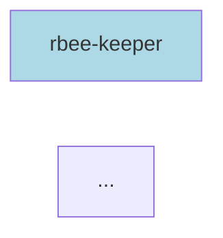

# Dependency Graph Analysis

Complete dependency analysis for the llama-orch monorepo, covering both Cargo (Rust) and pnpm (JavaScript/TypeScript) workspaces.

## Generated Files

This directory contains auto-generated dependency analysis files:

### 📊 [stats.md](./stats.md)

Human-readable statistics showing:
- Total package counts
- Most connected packages (highest dependencies)
- Most depended upon packages (reverse dependencies)

**Quick view:**
```bash
cat .docs/architecture/dependencies/stats.md
```

### 📋 [dependencies.json](./dependencies.json)

Machine-readable JSON format containing:
- Complete package metadata
- All dependency relationships
- Package types and paths

**Query with jq:**
```bash
# Count packages
jq '.packages | length' dependencies.json

# Find package
jq '.packages["rbee-keeper"]' dependencies.json

# List all dependencies
jq '.dependencies[] | "\(.from) -> \(.to)"' dependencies.json
```

### 🔷 [dependencies.mmd](./dependencies.mmd)

Mermaid diagram syntax for embedding in Markdown:

````markdown

````

**Renders in:**
- GitHub
- GitLab
- Many documentation tools

### 🔶 [dependencies.dot](./dependencies.dot)

GraphViz DOT format for professional visualizations:

```bash
# View interactively
xdot dependencies.dot

# Render to PNG
dot -Tpng dependencies.dot -o custom.png

# Render to SVG
dot -Tsvg dependencies.dot -o custom.svg
```

### 🖼️ [dependencies.png](./dependencies.png)

Pre-rendered PNG image of the complete dependency graph.

**Features:**
- Blue nodes: Cargo crates
- Green nodes: pnpm packages
- Solid arrows: Regular dependencies
- Dashed arrows: Dev dependencies

### 🖼️ [dependencies.svg](./dependencies.svg)

Pre-rendered SVG image (scalable, smaller file size).

**Use in:**
- Presentations
- Documentation
- Web pages

## Regenerating

To regenerate all files:

```bash
# From monorepo root
./scripts/generate-all-deps.sh .docs/architecture/dependencies/
```

Or generate specific formats:

```bash
# Statistics only
python scripts/dependency-graph.py > .docs/architecture/dependencies/stats.md

# JSON only
python scripts/dependency-graph.py --format json --output .docs/architecture/dependencies/dependencies.json

# Mermaid only
python scripts/dependency-graph.py --format mermaid --output .docs/architecture/dependencies/dependencies.mmd

# DOT only
python scripts/dependency-graph.py --format dot --output .docs/architecture/dependencies/dependencies.dot
```

## Key Findings

### Monorepo Scale

- **Total Packages:** 71
  - Cargo crates: 45 (63%)
  - pnpm packages: 26 (37%)

### Critical Infrastructure

Packages with highest reverse dependencies (most packages depend on them):

1. **observability-narration-core** - 17 dependents (24% of monorepo)
2. **operations-contract** - 6 dependents
3. **@rbee/ui** - 6 dependents

**Impact:** Changes to these packages affect many others. Extra care required!

### Complex Services

Packages with highest dependencies (depend on many others):

1. **rbee-hive** - 13 dependencies
2. **queen-rbee** - 11 dependencies
3. **@rbee/llm-worker-ui** - 9 dependencies

**Insight:** Potential refactoring targets to reduce complexity.

## Analysis Tools

### Find Dependency Path

Find how one package depends on another:

```bash
python scripts/find-dependency-path.py rbee-keeper observability-narration-core
```

**Shows:**
- Shortest path
- Alternative paths
- Circular dependency detection

### Impact Analysis

Before refactoring a package:

```bash
# Check reverse dependencies
python scripts/dependency-graph.py | grep "package-name"

# Find all dependents
jq -r '.dependencies[] | select(.to == "package-name") | .from' dependencies.json | sort -u
```

### Dead Code Detection

Find packages with no reverse dependencies:

```bash
jq -r '.packages | keys[]' dependencies.json > /tmp/all.txt
jq -r '.dependencies[].to' dependencies.json | sort -u > /tmp/used.txt
comm -23 /tmp/all.txt /tmp/used.txt
```

## Architecture Insights

### Layer 1: Core Infrastructure

Foundation packages used by many others:

- **observability-narration-core** - SSE-based narration system
- **operations-contract** - Type-safe operation definitions
- **timeout-enforcer** - Hard timeout enforcement
- **job-server** - Job tracking and SSE routing

### Layer 2: Service Binaries

Main daemon processes:

- **rbee-hive** - Hive daemon (manages workers)
- **queen-rbee** - Queen daemon (manages hives)
- **rbee-keeper** - CLI tool (user interface)
- **llm-worker-rbee** - Worker daemon (inference)

### Layer 3: UI Applications

Frontend applications:

- **@rbee/llm-worker-ui** - Worker management UI
- **@rbee/rbee-hive-ui** - Hive management UI
- **@rbee/ui** - Shared component library

## Maintenance Recommendations

### High Priority

1. **Reduce rbee-hive complexity** (13 deps) - Consider splitting
2. **Audit queen-rbee dependencies** (11 deps) - Review for consolidation
3. **Protect observability-narration-core** (17 dependents) - Breaking changes affect 24%

### Consolidation Opportunities

Similar packages that could be merged:

- **Lifecycle crates:** `lifecycle-local`, `lifecycle-ssh`, `lifecycle-shared`
- **Catalog crates:** `artifact-catalog`, `model-catalog`, `worker-catalog`
- **Contract crates:** Multiple `*-contract` packages

### Architecture Health

✅ **Good patterns:**
- Clear separation of concerns
- Contract packages with no dependencies
- Shared infrastructure layer

⚠️ **Watch for:**
- Packages with >10 dependencies
- Circular dependencies
- Unused packages

## Documentation

- **Full Usage Guide:** [../../../scripts/DEPENDENCY_GRAPH_USAGE.md](../../../scripts/DEPENDENCY_GRAPH_USAGE.md)
- **Real-World Examples:** [../../../scripts/EXAMPLES.md](../../../scripts/EXAMPLES.md)
- **Scripts Overview:** [../../../scripts/README.md](../../../scripts/README.md)
- **Complete Summary:** [../../../DEPENDENCY_ANALYSIS_COMPLETE.md](../../../DEPENDENCY_ANALYSIS_COMPLETE.md)

## Last Updated

Generated: November 4, 2025

**Auto-regenerate:**
```bash
# Add to CI/CD pipeline
./scripts/generate-all-deps.sh .docs/architecture/dependencies/
git add .docs/architecture/dependencies/
git commit -m "docs: update dependency graphs"
```

## See Also

- [Cargo Workspaces](https://doc.rust-lang.org/cargo/reference/workspaces.html)
- [pnpm Workspaces](https://pnpm.io/workspaces)
- [GraphViz Documentation](https://graphviz.org/documentation/)
- [Mermaid Diagrams](https://mermaid.js.org/)
