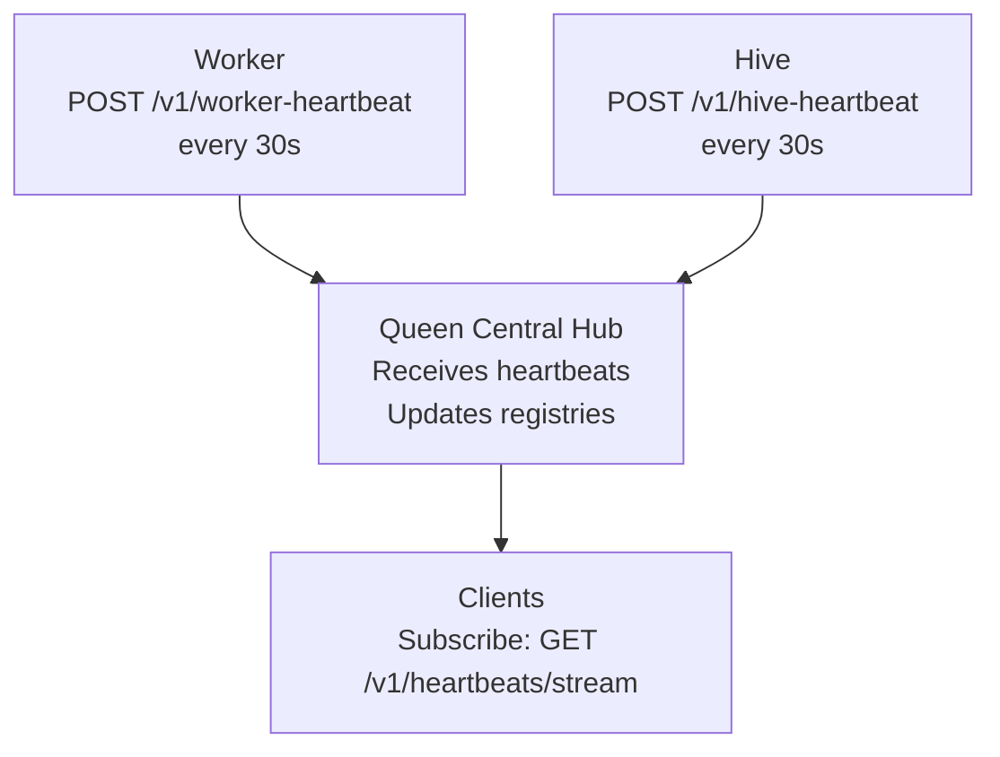
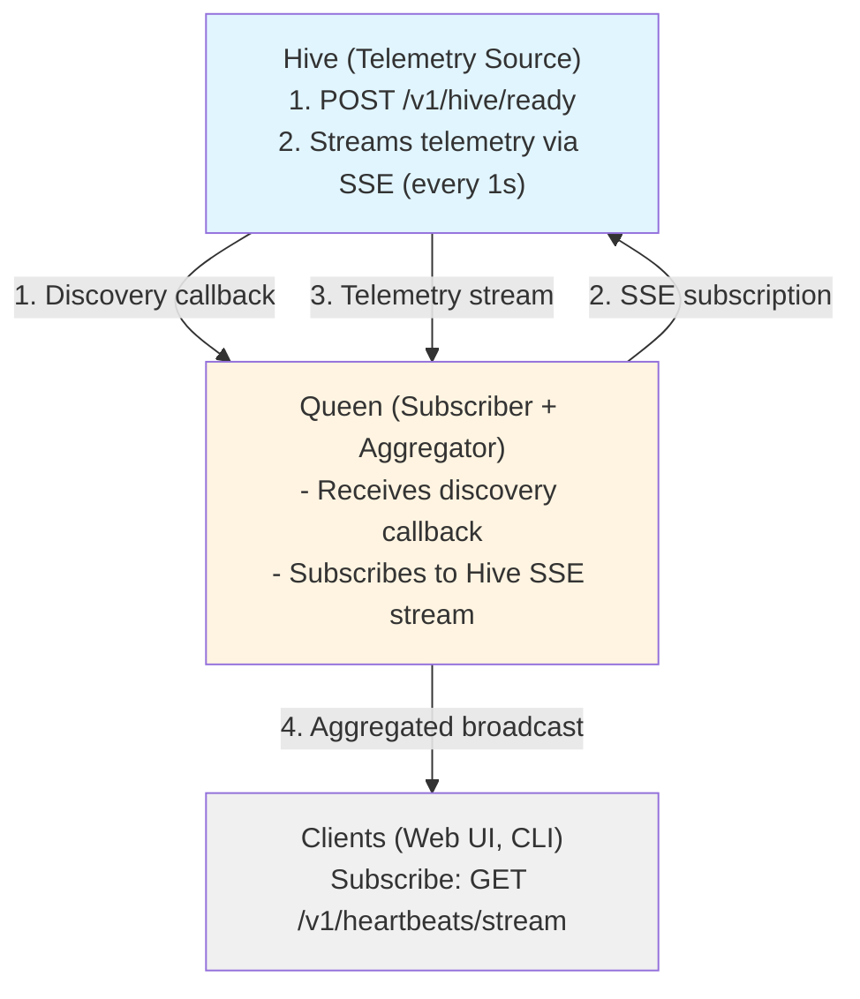
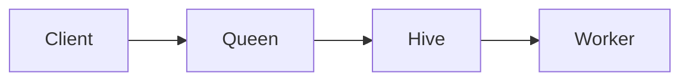
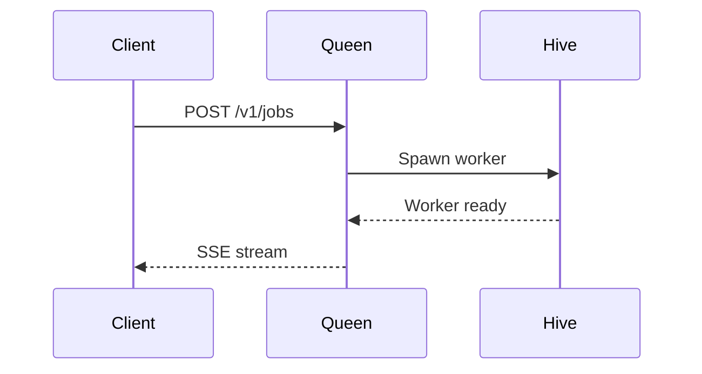
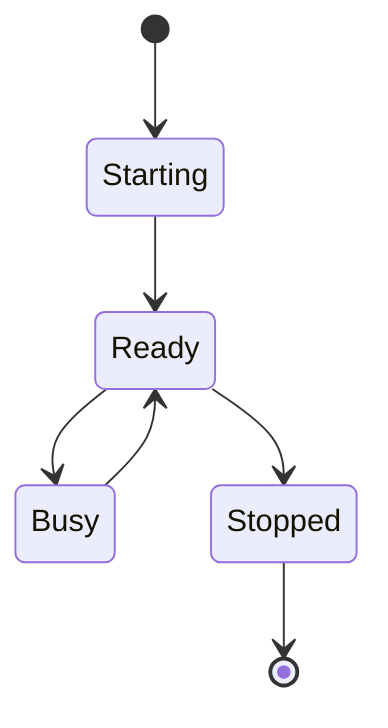
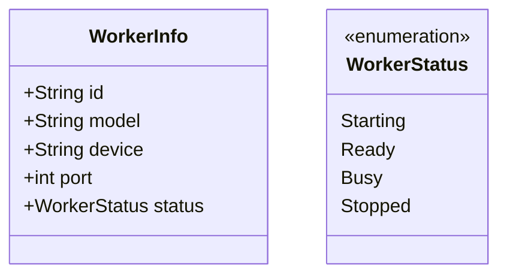

# TEAM-427: Diagram Component Plan

**Date:** 2025-11-08  
**Status:** 📋 PLANNING  
**Goal:** Replace ASCII art diagrams with proper React components

---

## 🎯 Problem Statement

**Current situation:**
- Documentation uses ASCII art diagrams in markdown code blocks
- Hard to maintain and update
- Not responsive on mobile
- Inconsistent styling
- Can't be themed (dark mode)
- No interactivity

**Example from Heartbeat Architecture:**
```
┌─────────────────────────────────────────────────────┐
│ Worker                                              │
│  - POST /v1/worker-heartbeat (every 30s)           │
└──────────────────┬──────────────────────────────────┘
                   │ DIRECT (not through hive)
                   ▼
┌─────────────────────────────────────────────────────┐
│ Queen (Central Hub)                                 │
```

---

## 🎨 Proposed Solution

### Option 1: Mermaid.js Integration (RECOMMENDED)

**Pros:**
- Industry standard for diagrams
- Simple text-based syntax
- Supports many diagram types (flowchart, sequence, class, etc.)
- Nextra has built-in support
- Dark mode support
- Responsive
- No custom components needed

**Cons:**
- Learning curve for Mermaid syntax
- Limited customization

**Implementation:**
```mdx

```

**Estimated effort:** 2-3 hours (convert existing diagrams)

---

### Option 2: Custom React Diagram Component

**Pros:**
- Full control over styling
- Can match rbee design system exactly
- Interactive features (hover, click)
- Animated transitions
- Custom icons

**Cons:**
- More development time
- More maintenance
- Need to build from scratch

**Component API:**
```tsx
<ArchitectureDiagram>
  <Node id="worker" label="Worker" details="POST /v1/worker-heartbeat (every 30s)" />
  <Node id="queen" label="Queen" details="Central Hub" />
  <Node id="clients" label="Clients" details="Subscribe: GET /v1/heartbeats/stream" />
  
  <Connection from="worker" to="queen" label="DIRECT" />
  <Connection from="queen" to="clients" label="SSE Stream" />
</ArchitectureDiagram>
```

**Estimated effort:** 8-12 hours (build component + convert diagrams)

---

### Option 3: Hybrid Approach

Use Mermaid for most diagrams, custom components for special cases.

**When to use Mermaid:**
- Architecture flows
- Sequence diagrams
- Simple relationships

**When to use custom:**
- Interactive diagrams
- Animated flows
- Complex state machines

**Estimated effort:** 3-5 hours (Mermaid setup + 1-2 custom components)

---

## 📋 Recommended Approach: Mermaid.js

### Phase 1: Setup (30 minutes)

1. **Verify Nextra Mermaid support**
   ```bash
   # Check if already configured
   grep -r "mermaid" frontend/apps/user-docs/
   ```

2. **Add Mermaid plugin if needed**
   ```bash
   cd frontend/apps/user-docs
   pnpm add @theguild/remark-mermaid
   ```

3. **Configure in next.config.js**
   ```javascript
   const withNextra = nextra({
     theme: 'nextra-theme-docs',
     themeConfig: './theme.config.tsx',
     mdxOptions: {
       remarkPlugins: [
         [remarkMermaid, { theme: 'default' }]
       ]
     }
   })
   ```

### Phase 2: Convert Existing Diagrams (2-3 hours)

**Files to update:**
1. `/app/docs/architecture/heartbeats/page.mdx` - 2 diagrams
2. `/app/docs/architecture/job-based-pattern/page.mdx` - 1 diagram
3. `/app/docs/architecture/api-split/page.mdx` - 1 diagram (if exists)
4. Any other pages with ASCII diagrams

**Conversion example:**

**Before (ASCII):**
```
┌─────────────────────────────────────────────────────┐
│ Hive (Telemetry Source)                             │
│  1. POST /v1/hive/ready (one-time discovery)        │
│  2. Streams telemetry via SSE (every 1s)            │
└──────────────────┬──────────────────────────────────┘
                   │ 
                   ▼
┌─────────────────────────────────────────────────────┐
│ Queen (Subscriber + Aggregator)                     │
```

**After (Mermaid):**


### Phase 3: Documentation (30 minutes)

Create guide for future teams:
- How to create Mermaid diagrams
- Common patterns (flowchart, sequence)
- Styling guidelines
- Examples

---

## 🎨 Mermaid Diagram Types

### 1. Flowchart (Architecture)



**Use for:**
- System architecture
- Data flow
- Component relationships

### 2. Sequence Diagram (Interactions)



**Use for:**
- API interactions
- Request/response flows
- Temporal sequences

### 3. State Diagram (Worker States)



**Use for:**
- Worker lifecycle
- Job states
- System states

### 4. Class Diagram (Data Models)



**Use for:**
- Data structures
- Type definitions
- Contracts

---

## 📝 Implementation Checklist

### Setup
- [ ] Check Nextra Mermaid support
- [ ] Install Mermaid plugin if needed
- [ ] Configure in next.config.js
- [ ] Test basic diagram renders
- [ ] Verify dark mode support

### Conversion
- [ ] Audit all pages for ASCII diagrams
- [ ] Convert Heartbeat Architecture diagrams
- [ ] Convert Job-Based Pattern diagrams
- [ ] Convert API Split diagrams
- [ ] Convert any other diagrams

### Documentation
- [ ] Create Mermaid usage guide
- [ ] Add examples to test-components page
- [ ] Document styling guidelines
- [ ] Add to component library docs

### Testing
- [ ] Verify all diagrams render correctly
- [ ] Test on mobile (responsive)
- [ ] Test dark mode
- [ ] Test in all browsers
- [ ] Build succeeds

---

## 🎯 Success Criteria

**Functional:**
- ✅ All ASCII diagrams converted to Mermaid
- ✅ Diagrams render correctly
- ✅ Mobile responsive
- ✅ Dark mode support
- ✅ Build succeeds

**Quality:**
- ✅ Consistent styling across all diagrams
- ✅ Clear and readable
- ✅ Better than ASCII art
- ✅ Easy to maintain

**Documentation:**
- ✅ Usage guide created
- ✅ Examples provided
- ✅ Guidelines documented

---

## 🚀 Alternative: React Flow (Advanced)

If Mermaid is too limited, consider React Flow for interactive diagrams:

```bash
pnpm add reactflow
```

```tsx
import ReactFlow from 'reactflow';
import 'reactflow/dist/style.css';

const nodes = [
  { id: '1', data: { label: 'Worker' }, position: { x: 0, y: 0 } },
  { id: '2', data: { label: 'Queen' }, position: { x: 0, y: 100 } },
];

const edges = [
  { id: 'e1-2', source: '1', target: '2', label: 'heartbeat' },
];

export function ArchitectureDiagram() {
  return <ReactFlow nodes={nodes} edges={edges} />;
}
```

**Pros:**
- Fully interactive
- Pan, zoom, drag
- Custom node components
- Animations

**Cons:**
- Heavy dependency
- More complex
- Overkill for static diagrams

**Recommendation:** Start with Mermaid, add React Flow only if needed.

---

## 📊 Effort Estimate

### Option 1: Mermaid.js (RECOMMENDED)
- **Setup:** 30 minutes
- **Convert diagrams:** 2-3 hours
- **Documentation:** 30 minutes
- **Testing:** 30 minutes
- **Total:** 4 hours

### Option 2: Custom Component
- **Design:** 2 hours
- **Build component:** 4-6 hours
- **Convert diagrams:** 2 hours
- **Documentation:** 1 hour
- **Testing:** 1 hour
- **Total:** 10-12 hours

### Option 3: React Flow
- **Setup:** 1 hour
- **Learn library:** 2 hours
- **Convert diagrams:** 4 hours
- **Documentation:** 1 hour
- **Testing:** 1 hour
- **Total:** 9 hours

---

## 🎯 Recommendation

**Go with Mermaid.js (Option 1)**

**Reasons:**
1. ✅ Industry standard
2. ✅ Quick to implement (4 hours)
3. ✅ Easy to maintain
4. ✅ Good enough for our needs
5. ✅ Nextra likely has built-in support
6. ✅ Dark mode works
7. ✅ Responsive by default

**Next steps:**
1. Verify Nextra Mermaid support
2. Convert 1 diagram as proof of concept
3. If successful, convert all diagrams
4. Document usage for future teams

---

## 📚 Resources

**Mermaid.js:**
- Docs: https://mermaid.js.org/
- Live Editor: https://mermaid.live/
- Nextra Mermaid: https://nextra.site/docs/guide/mermaid

**React Flow:**
- Docs: https://reactflow.dev/
- Examples: https://reactflow.dev/examples

**Alternatives:**
- D3.js (too complex)
- Cytoscape.js (graph theory focus)
- vis.js (outdated)

---

**TEAM-427 Plan Complete** ✅

**Recommended:** Implement Mermaid.js integration (4 hours)  
**Priority:** MEDIUM (improves quality but not critical)  
**Impact:** HIGH (better diagrams, easier maintenance)

**Next Team:** Implement this plan or continue with other documentation tasks.
