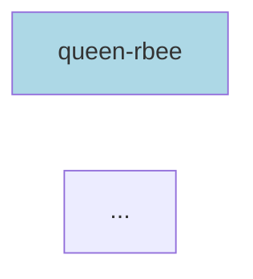

# Dependency Graph Generator

Comprehensive tool to analyze and visualize dependencies across both Cargo (Rust) and pnpm (JavaScript/TypeScript) workspaces in the llama-orch monorepo.

## Quick Start

```bash
# Show statistics (default)
python scripts/dependency-graph.py

# Generate GraphViz DOT format
python scripts/dependency-graph.py --format dot --output deps.dot

# Generate Mermaid diagram
python scripts/dependency-graph.py --format mermaid --output deps.mmd

# Generate JSON data
python scripts/dependency-graph.py --format json --output deps.json
```

## Output Formats

### 1. Statistics (default)

Human-readable summary showing:
- Total package counts (Cargo + pnpm)
- Most connected packages (highest number of dependencies)
- Most depended upon packages (reverse dependencies)

```bash
python scripts/dependency-graph.py
```

**Example output:**
```
# Dependency Graph Statistics

**Total Packages:** 85
- Cargo crates: 62
- pnpm packages: 23

## Most Connected Packages (by dependencies)
- **queen-rbee** (cargo): 15 dependencies
- **rbee-hive** (cargo): 12 dependencies
- **rbee-keeper** (cargo): 10 dependencies

## Most Depended Upon (reverse dependencies)
- **narration-core** (cargo): used by 18 packages
- **shared-contract** (cargo): used by 12 packages
- **rbee-ui** (pnpm): used by 8 packages
```

### 2. GraphViz DOT Format

Generate `.dot` file for visualization with GraphViz tools:

```bash
# Dark mode (default) - better for dark backgrounds
python scripts/dependency-graph.py --format dot --output deps.dot

# Light mode - for light backgrounds
python scripts/dependency-graph.py --format dot --light-mode --output deps.dot

# Render to PNG (requires graphviz installed)
dot -Tpng deps.dot -o deps.png

# Render to SVG
dot -Tsvg deps.dot -o deps.svg

# Interactive viewer
xdot deps.dot
```

**Features:**
- **Dark mode (default):** Dark background with bright colors
  - Cargo crates: bright blue (`#4a9eff`)
  - pnpm packages: bright green (`#66bb6a`)
  - WASM bridges: bright yellow (`#ffd54f`)
  - Background: `#1e1e1e`
- **Light mode:** White background with pastel colors
  - Cargo crates: light blue
  - pnpm packages: light green
  - WASM bridges: light yellow
- **Arrow direction:** FROM dependent TO dependency (library it uses)
- Solid arrows: regular dependencies
- Dashed arrows: dev dependencies

### 3. Mermaid Diagram

Generate Mermaid syntax for embedding in Markdown/documentation:

```bash
python scripts/dependency-graph.py --format mermaid --output deps.mmd
```

**Usage in Markdown:**
````markdown

````

**Features:**
- Renders in GitHub, GitLab, and many documentation tools
- Blue nodes: Cargo crates
- Green nodes: pnpm packages
- Interactive in supported viewers

### 4. JSON Format

Machine-readable format for custom analysis:

```bash
python scripts/dependency-graph.py --format json --output deps.json
```

**Structure:**
```json
{
  "packages": {
    "queen-rbee": {
      "name": "queen-rbee",
      "path": "bin/10_queen_rbee",
      "type": "cargo",
      "metadata": {
        "version": "0.0.0",
        "description": "..."
      },
      "dependencies": ["narration-core", "job-server"],
      "devDependencies": []
    }
  },
  "dependencies": [
    {
      "from": "queen-rbee",
      "to": "narration-core",
      "type": "dependency"
    }
  ]
}
```

## Use Cases

### 1. Find Circular Dependencies

```bash
python scripts/dependency-graph.py --format json --output deps.json
# Then use jq or custom script to detect cycles
```

### 2. Impact Analysis

Before refactoring a package, see what depends on it:

```bash
python scripts/dependency-graph.py | grep "used by"
```

### 3. Architecture Documentation

Generate visual diagrams for documentation:

```bash
# For docs
python scripts/dependency-graph.py --format mermaid --output .docs/architecture/dependencies.mmd

# For presentations
python scripts/dependency-graph.py --format dot --output deps.dot
dot -Tpng deps.dot -o architecture.png
```

### 4. Dependency Audit

Find packages with too many dependencies (potential refactoring targets):

```bash
python scripts/dependency-graph.py | head -20
```

### 5. Dead Code Detection

Find packages with zero reverse dependencies (potentially unused):

```bash
python scripts/dependency-graph.py --format json | jq '.packages | to_entries | map(select(.key as $k | [.] | map(.value.dependencies[] == $k) | any | not)) | .[].key'
```

## Installation Requirements

### Python 3.11+

The script uses `tomllib` (built-in since Python 3.11):

```bash
python --version  # Should be 3.11 or higher
```

If you have Python 3.10 or earlier, install `tomli`:

```bash
pip install tomli
# Then change: import tomllib → import tomli as tomllib
```

### Optional: GraphViz (for DOT rendering)

```bash
# Ubuntu/Debian
sudo apt install graphviz xdot

# macOS
brew install graphviz

# Arch Linux
sudo pacman -S graphviz
```

## Advanced Usage

### Filter by Package Type

```bash
# Only Cargo crates
python scripts/dependency-graph.py --format json | jq '.packages | to_entries | map(select(.value.type == "cargo"))'

# Only pnpm packages
python scripts/dependency-graph.py --format json | jq '.packages | to_entries | map(select(.value.type == "pnpm"))'
```

### Find Dependency Chains

```bash
# Generate DOT, then use GraphViz to find paths
python scripts/dependency-graph.py --format dot --output deps.dot
# Use tred to find transitive reduction (shortest paths)
tred deps.dot | dot -Tpng -o minimal-deps.png
```

### Integration with CI/CD

```bash
#!/bin/bash
# Check for new circular dependencies

python scripts/dependency-graph.py --format json --output deps.json

# Custom script to detect cycles
if python scripts/check-cycles.py deps.json; then
  echo "✅ No circular dependencies"
else
  echo "❌ Circular dependencies detected!"
  exit 1
fi
```

## How It Works

1. **Cargo Analysis:**
   - Reads `Cargo.toml` workspace members
   - Parses each crate's `Cargo.toml`
   - Extracts `[dependencies]` and `[dev-dependencies]`
   - Filters to only internal workspace packages

2. **pnpm Analysis:**
   - Reads `pnpm-workspace.yaml` packages list
   - Parses each `package.json`
   - Extracts `dependencies` and `devDependencies`
   - Filters to only workspace packages (by naming convention)

3. **Graph Generation:**
   - Builds unified graph of all packages
   - Tracks both regular and dev dependencies
   - Generates output in requested format

## Limitations

- **pnpm workspace detection:** Uses naming heuristics (`@rbee/`, `rbee-*`, known package names)
- **TOML parsing:** Requires Python 3.11+ or `tomli` package
- **Glob patterns:** Simple expansion (doesn't handle complex globs)
- **External dependencies:** Not tracked (only internal workspace packages)

## Troubleshooting

### "No module named 'tomllib'"

You're using Python < 3.11. Either:
- Upgrade to Python 3.11+, or
- Install `tomli`: `pip install tomli` and change import

### "Package not found"

Check that:
- Package has valid `Cargo.toml` or `package.json`
- Package is listed in workspace members
- Package name matches between files

### Empty graph

Verify:
- You're running from monorepo root
- `Cargo.toml` and `pnpm-workspace.yaml` exist
- Workspace members are correctly defined

## Examples

### Generate all formats

```bash
#!/bin/bash
# Generate all output formats

python scripts/dependency-graph.py --format stats > deps-stats.md
python scripts/dependency-graph.py --format json --output deps.json
python scripts/dependency-graph.py --format dot --output deps.dot
python scripts/dependency-graph.py --format mermaid --output deps.mmd

# Render DOT to images
dot -Tpng deps.dot -o deps.png
dot -Tsvg deps.dot -o deps.svg

echo "✅ Generated: deps-stats.md, deps.json, deps.dot, deps.mmd, deps.png, deps.svg"
```

### Find packages with no dependencies

```bash
python scripts/dependency-graph.py --format json | \
  jq -r '.packages | to_entries | map(select((.value.dependencies | length) == 0 and (.value.devDependencies | length) == 0)) | .[].key'
```

### Count dependencies per package

```bash
python scripts/dependency-graph.py --format json | \
  jq -r '.packages | to_entries | map("\(.key): \((.value.dependencies | length) + (.value.devDependencies | length))") | .[]' | \
  sort -t: -k2 -rn
```

## Contributing

To extend the script:

1. **Add new output format:** Implement `generate_<format>()` method
2. **Improve detection:** Update `_is_workspace_package()` heuristics
3. **Add filters:** Extend CLI arguments for filtering by type/path/etc.
4. **Cycle detection:** Add graph traversal algorithm

## See Also

- [Cargo Workspaces](https://doc.rust-lang.org/cargo/reference/workspaces.html)
- [pnpm Workspaces](https://pnpm.io/workspaces)
- [GraphViz Documentation](https://graphviz.org/documentation/)
- [Mermaid Diagrams](https://mermaid.js.org/)
